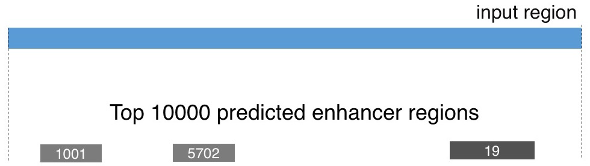
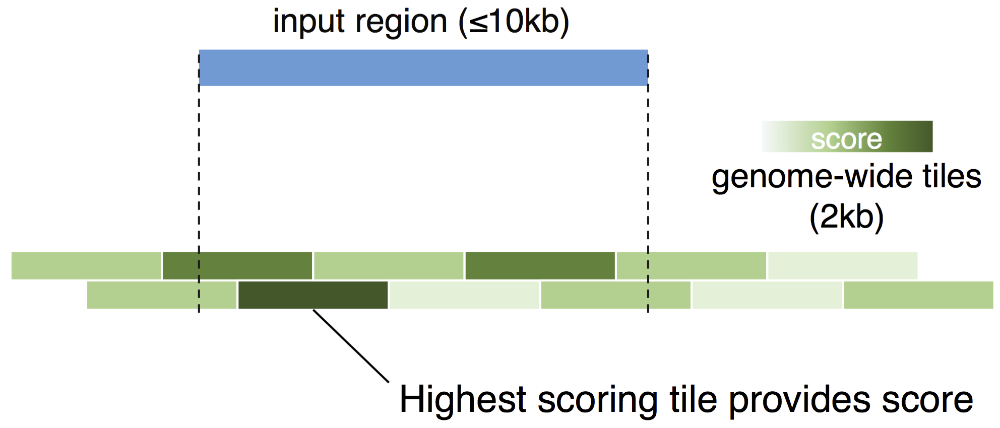
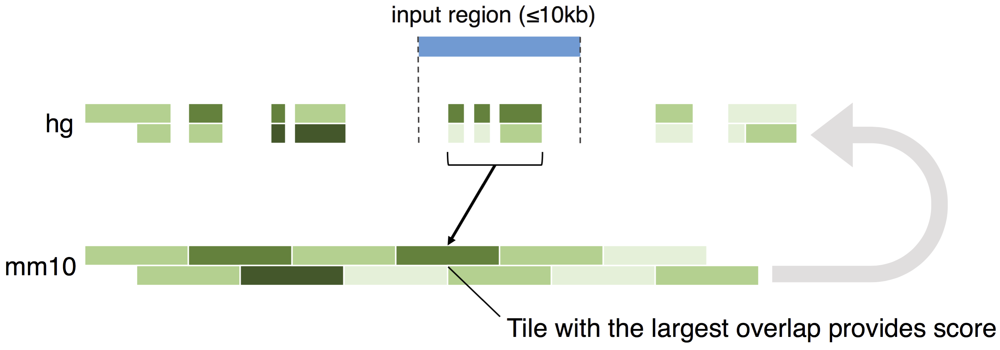

### Welcome to home of the Limb Enhancer Genie

Before submitting your data, take a few moments to read this documentation. The ways of the Genie are not as mysterious as they may seem. To explore your data visually, you can download the results in BED format and upload them to the UCSC Genome Browser along with our '**limb-trackhub**' (mm10/mm9), that will be automatically added to your session via [**this link**](http://genome.ucsc.edu/cgi-bin/hgTracks?db=mm10&hubUrl=http://portal.nersc.gov/dna/RD/ChIP-Seq/LEG_trackhub/hub.txt).

Examples about the usage (for both mouse and human queries) are provided in the Vignettes.

The Limb Enhancer Genie was trained on published [**VISTA enhancers**](http://enhancer.lbl.gov/).

-----

#### Analysis Type

**Scan for Top** looks for any of the top 10,000 predicted limb-enhancers that overlap (≥ 1bp) the provided intervals (Figure 1). If a region overlaps multiple predicted enhancers, all of them are returned. The coordinates of the predicted enhancers, the corresponding scores computed by the selected Method (described below) and the associated genome-wide ranks are provided in the Results tab. This analysis is particularly useful to scan large regions for all the predicted enhancers overlapping them, or to find all the predicted enhancers that overlap a set of shorter regions of interest (e.g. peaks defined by ChIP-seq). If the region(s) provided do not overlap any predicted limb-enhancer, the output is empty. Importantly, the top 10,000 predictions were filtered to exclude promoters (-5kb +2kb around a TSS, Ensembl v83) as well as the VISTA enhancers used to train the models. This mode is only available for mouse-coordinate input.

<b>Figure 1: </b>Scan for Top

**Score short region(s)** ranks every region provided and reports an associated score computed by the selected Method (described below). First, regions longer than 10 kb are shrunk to 10kb and regions shorter than 1kb are expanded to 1kb (transformations are performed fixed on the center of each region). It is suggested to perform these transformations prior to submitting your data, if necessary. Next, the regions are overlapped with 2kb tiles (spanning the entire mouse genome) for which pre-computed scores are available. When mouse-coordinates are provided as input (Figure 2), each region is assigned the score of the highest scoring overlapping tile for which the overlap is at least 1kb.

<b>Figure 2:</b> Score short region(s) for mouse-coordinate input

To provide results for human coordinates, the tiles from the mouse genome were mapped using liftOver. When human coordinates are provided, the score of the mm10-tile with the largest number of basepairs lifted over to each input region is reported (lifted.bp in the results-table, Figure 3). Note that this number may be larger than the size of the original submitted region if the region was shorter than 1kb. We suggest using regions around 2kb when submitting human coordinates.

<b>Figure 3:</b> Score short region(s) for human-coordinate input

Finally, after assigning a score to each region, a genome-wide rank is imputed by comparing each score to those of the highest-ranking top 10,000 predictions. If the imputed genome-wide rank is below 10,000, NA is returned. This allows the ranking of regions that were originally excluded from the genome-wide predictions (i.e. regions close to promoters or overlapping the training set). The results table contains both the original coordinates (in the assembly provided by the user, before any transformation) and the coordinates of the tile that was used to compute the score (mm10 coordinates). The table also indicates if the regions provided show any direct overlap with one of the top 10,000 predicted enhancers, a promoter, or an element used to train the Limb Enhancer Genie.

-----

#### Method

**Combined Model** combines the outputs of multiple models trained on either chromatin signatures or conserved transcription factor binding sites via a Ridge-regularized generalized linear model. The reported scores have a probabilistic interpretation, as they are directly proportional to the expected validation rate in reporter assays. This model showed the highest, most robust performance on the VISTA-dataset.

**Sum of Ranks** scores are somewhat similar to the above, but the aforementioned models are simply combined as the sum of the individual genome-wide output ranks, weighting the sequence-based predictions less than those based on chromatin. As opposed to the "Combined Model"", these scores are simply scaled between 0 and 1 and they have no probabilistic interpretation. This scoring sceme resulted in the highest enrichments of the predicted enhancers near limb-developmental genes (as assessed by <a href="http://bejerano.stanford.edu/great/public/html/index.php">GREAT</a>).

