## Vignette 1 : Scan for Top 

In this example we seek to identify potential regulators of the Sox9 gene and then expand our analysis to a set of 411 genes using published Capture-C data.

### Finding Enhancers Inside a Large Genomic Region

Using a naive approach, we simply scan the 500,000bp region surrounding Sox9 in the mm9 genome (chr11:112368898-112868897) by entering the coordinates in the "copy-paste from Genome Browser"-field. For "Analysis Type" we select "Scan for Top" (the default), in "Method" we select "Sum of Ranks" and specify mm9 as "Input Genome" (**Figure 1**).

<center>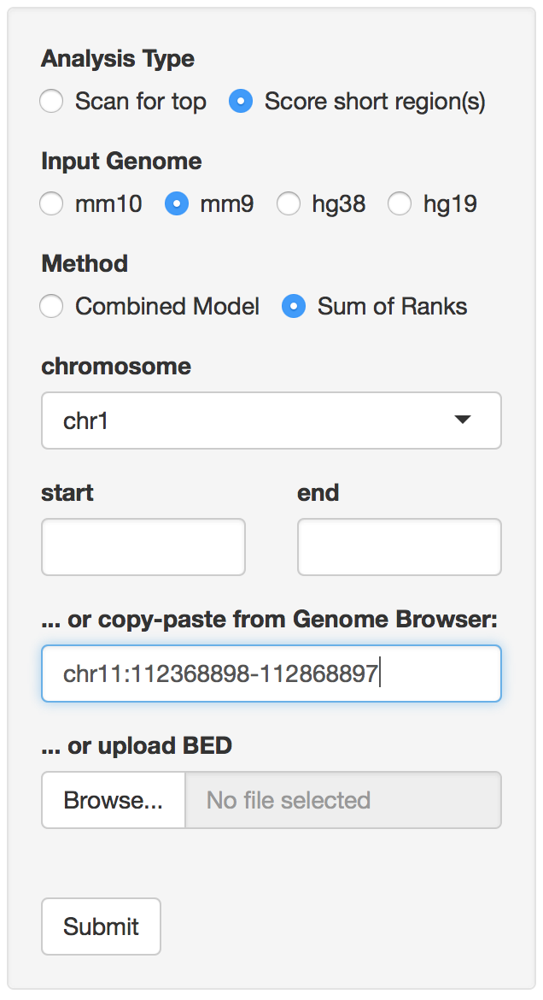</center>
<center><p style="padding-bottom: 7px"><b>Figure 1: </b>Submitting a large region as plain text</p></center>

This will find all of the top 10,000 genome-wide enhancer-predictions which overlap the specified large input region, with scores calculated according to the selected method (refer to Documentation-tab for more information on the scoring methods).

Once we click the "Submit"-button, we are taken to the Results-tab showing the coordinates of the predicted limb-enhancers overlapping the specified 500kb input region (**Figure 2**).

<center>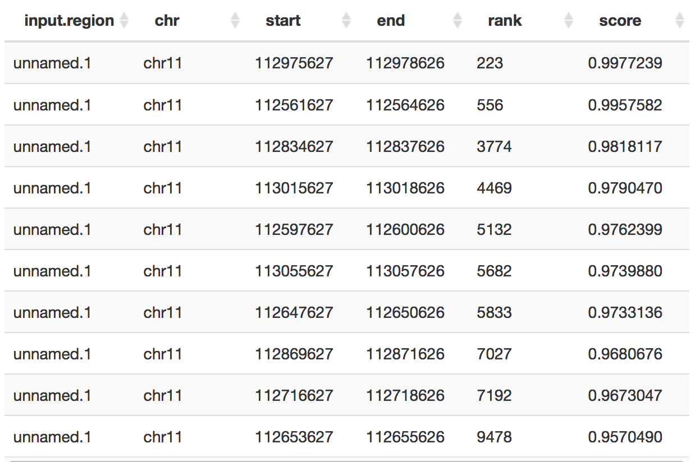</center>
<center><p style="padding-bottom: 7px"><b>Figure 2: </b>Enhancer Predictions Close to Sox9</p></center>

We find a set of 10 newly predicted enhancer regions with varying scores. The coordinates are mm9, as we supplied mm9 input coordinates and ranks are calculated genome-wide. By default, the results are ordered by their score, i.e. the predictions that are most likely to be limb-specific enhancers at e11.5 are at the very top.

However, simply because these regions lie close to Sox9 does not necessarily mean they are regulators of the Sox9 gene. For this reason, in a second, more data-driven approach explained below, we will incorporate published Capture-C data into the analysis. 

### Finding Enhancers Using Capture-C Data

In their [2017 paper](https://www.ncbi.nlm.nih.gov/pubmed/27923844)
*Characterization of hundreds of regulatory landscapes in developing limbs reveals two regimes of chromatin folding* ([GSM2251424](https://www.ncbi.nlm.nih.gov/geo/query/acc.cgi?acc=GSM2251424)) Andrey G et al. characterized the regulatory environment of genes in developing mouse-limbs at E11.5. We use the list of predicted interactors with Sox9 in forelimb at E11.5, [available here](http://portal.nersc.gov/dna/RD/ChIP-Seq/LEG_trackhub/chr11_112641359_112646504_Sox9.peaks.bed), upload it using the "upload BED" option (**Figure 3**) and adjust the other settings as before.

<center></center>
<center><p style="padding-bottom: 7px"><b>Figure 3: </b>Uploading a BED-file</p></center>

We find that out of 34 submitted regions, 3 overlap newly predicted limb-enhancers (**Figure 4**), with one of them even ranking in the top 1,000 highest scoring elements. Notably, none of these were identified by our simple approach above, as they are too far away from the target gene.

<center>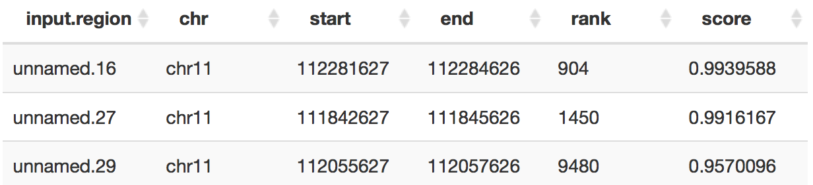</center>
<center><p style="padding-bottom: 7px"><b>Figure 4: </b>Enhancer predictions for Sox9 based on Capture C data</p></center>

But why look only at Sox9? We decide we want to find potential enhancers for all the genes analysed in the study. For this, on our machine, we switch to the folder containing all the BED-files and run:

```{bash, eval=FALSE}
# merge BED-files and name regions according to target gene:
awk 'OFS="\t" {print $0, FILENAME}' *.peaks.bed | sed 's/chr[0-9XY]*_[0-9]*_[0-9]*_//g' | sed 's/\.peaks\.bed//g' > combined_peaks.bed
```

For convenience, the generated merged file can be downloaded [here](http://portal.nersc.gov/dna/RD/ChIP-Seq/LEG_trackhub/combined_peaks.bed). We repeat the analysis with this BED-file and get a list of enhancer predictions, all of which overlap a Capture-C peak including the information on which gene they likely regulate (**Figure 5**). Out of 3329 regions submitted, 343 (10.3%) overlap a novel enhancer-prediction. Note that some enhancers are predicted to interact with multiple genes.

<center>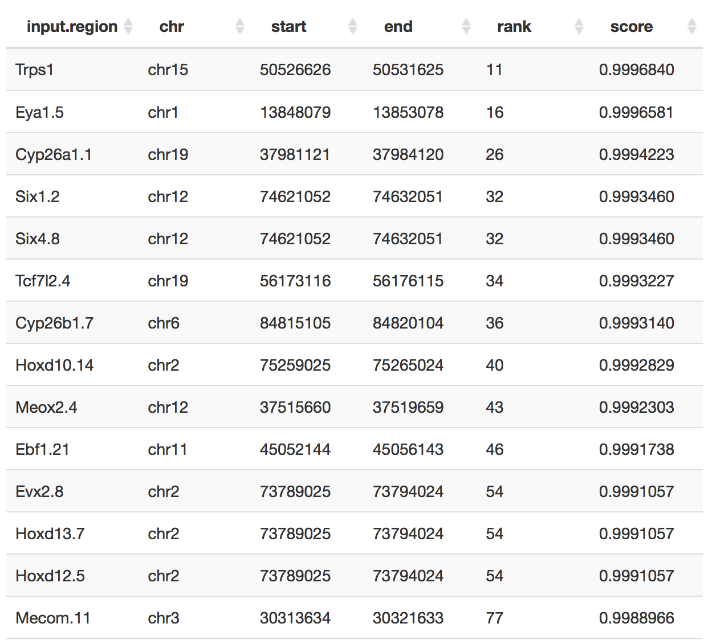</center>
<center><p style="padding-bottom: 7px"><b>Figure 5: </b>Results-tab: All CC peaks</p></center>

In order to provide unique names, the LEG appended a number to each element-name ("input.region") if there were multiple elements with the same name inside of the input file. E.g the element "Hoxd10.14"" is the 14th element with the name "Hoxd10" in our input file.

------

## Vignette 2 : Finding Enhancers Active in Human Limbs - Score Short Region(s)

In this example, we will seek to identify a set of ChIP-seq peaks from human tissue that most likely correspond to conserved limb-specific enhancers.

In their [2012 paper](https://www.ncbi.nlm.nih.gov/pubmed/23827682) *The Evolution of Lineage-Specific Regulatory Activities in the Human Embryonic Limb*, Cotney et al. identified regions of the human genome enriched for the histone mark H3K27ac at multiple developmental stages (E33, E41, E44 and E47) from human limb-tissue. For this demonstration, we downloaded the human peaks called from [here](https://www.ncbi.nlm.nih.gov/geo/query/acc.cgi?acc=GSE42413) and performed additional pre-processing described below.

### Pre-processing Peaks in R

Peaks from all developmental time-points were intersected. After intersection, regions shorter than 2kb were expanded to 2kb and merged if they overlapped. Finally, regions longer than 10kb were devided into smaller regions of ~2kb. **We recommend applying similar transformations for any regions submitted in the "Score Short Region(s)" analysis mode**. This can easily be done by adapting the R-code below:

```{r, eval=FALSE}

# switch to folder containing the BED-files to intersect:
# setwd('')

library(GenomicRanges)
library(rtracklayer)

beds<-system('ls *.bed | sort', intern=TRUE)
beds<-lapply(beds, import.bed)
intsct<-beds[[1]]

# intersecting:
for ( i in 2:length(beds) ) intsct <- GenomicRanges::intersect(intsct, beds[[i]])

# resize short regions to 2kb and merging:
intsct[ width(intsct) < 2000 ] <- resize(intsct[width(intsct) < 2000], width=2000, fix='center')
intsct<-reduce(intsct)

# splitting large regions into smaller pieces:
large<-which(width(intsct) > 10000)
large_regions<-intsct[ large ]
intsct<-intsct[ -large ]
large_regions<-tile(large_regions, width = 2000)
large_regions<-unlist(large_regions)
regions<-c(intsct, large_regions)
regions<-sort(regions)

# hist(width(regions), 20, xlab='width [bp]', main='Histogram of Width')

export(regions, con = 'GSE42413_human_H3K27ac_intersections.bed')

```


Performing these steps resulted in a set of 15,586 regions available [here](http://portal.nersc.gov/dna/RD/ChIP-Seq/LEG_trackhub/GSE42413_human_H2K27ac_intersections.bed). **Figure 6** shows the distribution of element widths submitted in this analysis.

<center>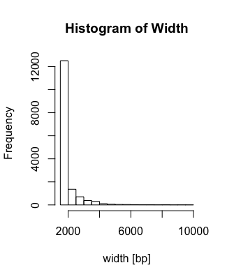</center>
<center><p style="padding-bottom: 7px"><b>Figure 6: </b>Histogram of element-width after pre-processing peaks</p></center>

### Scoring hg19 Peaks 

We now submit these coordinates to the Limb Enhancer Genie. On the sidebarpanel to the left, we select the corresponding genome (hg19) and upload the BED-file. Note that the analysis type will automatically switch to "Score short region(s)" as this is the only one available for human coordinates. When the upload is complete, the sidebarpanel should look as in **Figure 7**. 

<center>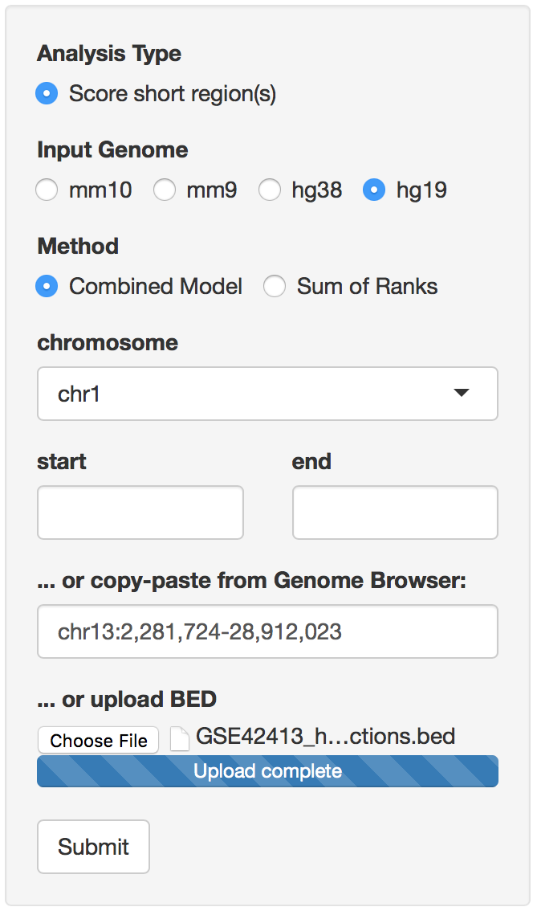</center>
<center><p style="padding-bottom: 7px"><b>Figure 7: </b>Ready to Start Analysis, Score Short Region(s)</p></center>

We start the analysis by pressing "Submit". This should take around 20 seconds, in which the Limb Enhancer Genie finds overlaps of the submitted regions (in our case intersected ChIP-seq peaks) to enhancer-predictions originating from the mouse genome. Those predictions (spanning the entire mouse genome) were mapped to the human genome using liftOver. For each input region, the LEG will try to find the prediction with the largest overlap, as indicated in **Figure 8**. This is slightly different from the way the analysis works for mouse-coordinates (mm10/mm9, refer to Documentation-tab for details).

<center></center>
<center><p style="padding-bottom: 7px"><b>Figure 8: </b>Score Short Regions for human-coordinate input</p></center>

Once the analysis is complete, we are redirected to the Results-tab. By default, the results are ordered by their score, i.e. the ones that are most likely to be limb-specific enhancers at e11.5 are at the very top (**Figure 9**). Note that the columns reported in "Scan for Top" and "Score Short Region(s)" are not the same.

<center>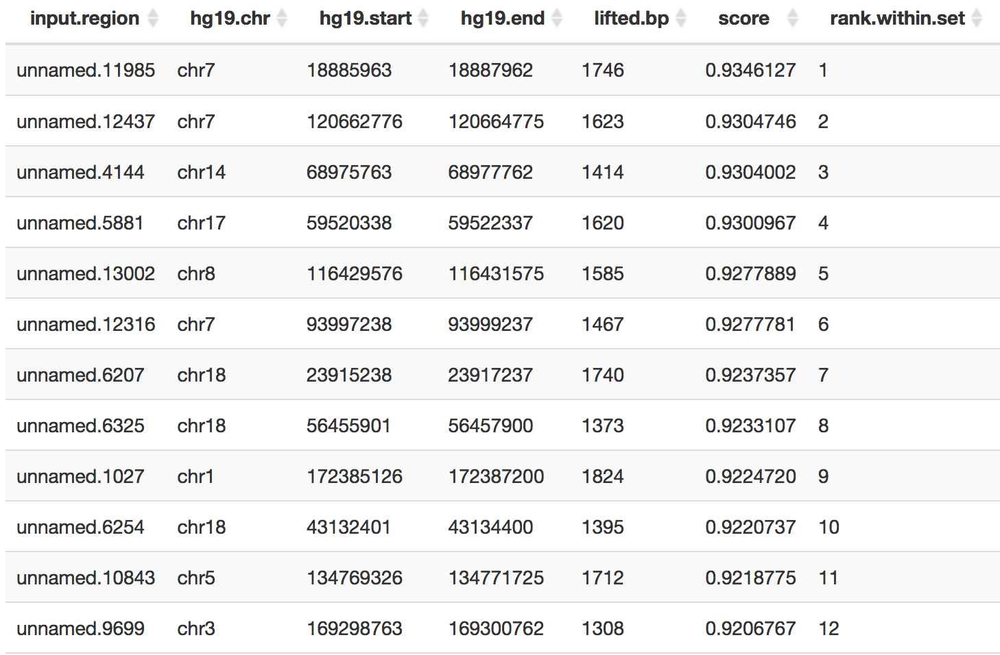</center>
<center><p style="padding-bottom: 7px"><b>Figure 9: </b>Score Short Region(s)  Results (part 1)</p></center>

Here "lifted.bp" indicates the number of basepairs that were mapped from the original mm10 prediction to the human location for which predictions were requested (denoted by "hg19.chr", hg19.start" and "hg19.end"). The maximum number of basepairs that could possibly be mapped is 2000bp (= size of the tiles used to predict enhancers genome-wide in mouse, see **Figure 8**). In this case, for the highest scoring prediction, almost the entire mm10 region was mapped to hg19 coordinates (1746 bp). By scrolling to the right we can identify the genomic locations in mouse from which the predictions originated (**Figure 10**).

<center>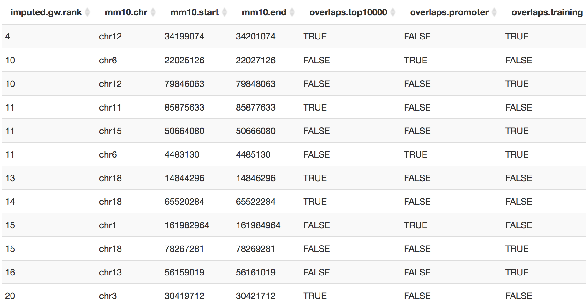</center>
<center><p style="padding-bottom: 7px"><b>Figure 10: </b>Score Short Region(s)  Results (part 2)</p></center>

We find that the three highest scoring predictions either overlap elements in VISTA used to train the LEG ("overlaps.training") or annotated promoters in the ensembl 82 release ("overlaps.promoter"). The fourth highest ranking element overlaps neither of these classes and also overlaps one of the the top 10,000 predicted limb-enhancers ("overlaps.top10000") that are parsed when using the "Scan for Top" analysis mode. We decide to take a closer look at that prediction (mm10, chr11:85,875,633-85,877,633).

### Inspecting Results in the Limb-Trackhub

For this, we go to the [limb-trackhub](http://genome.ucsc.edu/cgi-bin/hgTracks?db=mm10&hubUrl=http://portal.nersc.gov/dna/RD/ChIP-Seq/LEG_trackhub/hub.txt) in the UCSC genome-browser. Coordinates can be copied directly from the results table, as seen in **Figure 11**.

<center>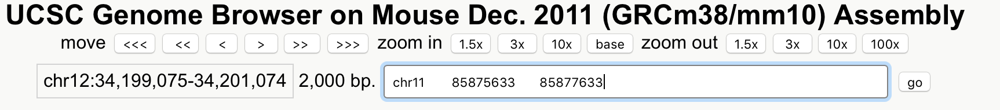</center>
<center><p style="padding-bottom: 7px"><b>Figure 11: </b>Browsing Predictions in the Track-Hub</p></center>

Zooming out, we see that the element lies upstream (~10kb) of the Tbx4 transcription factor (**Figure 12**), which is an important regulator for hind-limb development ([Naiche 2003](http://dev.biologists.org/content/130/12/2681?ijkey=718eaea70fc1547b5ad5d43b506188cca917b277&keytype2=tf_ipsecsha)).

<center>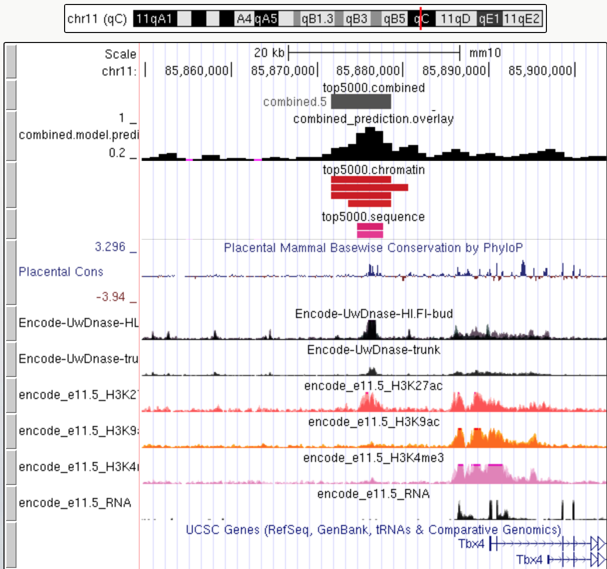</center>
<center><p style="padding-bottom: 7px"><b>Figure 12: </b>Genome-browser View Centered on Predicted Enhancer</p></center>

### Downloading Results

We now switch to the Download-tab, where we can download the complete results table or a specified number of elements with the highest scores. We decide to download the highest ranking 1,000 predictions (hg19 coordinates) in BED format (**Figure 13**), resulting in the BED-file available [here](http://portal.nersc.gov/dna/RD/ChIP-Seq/LEG_trackhub/EnhancerGenieResults.bed).

<center>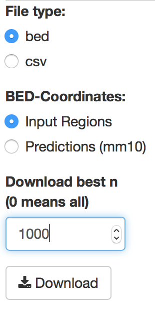</center>
<center><p style="padding-bottom: 7px"><b>Figure 13: </b>Downloading Results.</p></center>

Following the BED-format specifications, the score-column contains an integer between 1 and 999 corresponding to the score multiplied by a factor of 1000. For exact scores, the results have to be downloaded as CSV.

We now leave the LEG and submit our newly found enhancer candidates to [**GREAT**]("http://bejerano.stanford.edu/great/public/html/index.php") (version 3.0.0, hg19). Are they enriched near genes related to limb-development?

We find that the highest scoring 1,000 regions are 3.8 fold enriched near genes involved in "limb morphogenesis" (5.3944e-27 Binom FDR Q-Val, **Figure 14**). And strongly enriched near genes expresssed in limb at developmental stages TS17 and TS19 (MGI Expression: Detected, Binom FDR Q-Val 4.9823e-63 and 2.2110e-55, respectively).

<center>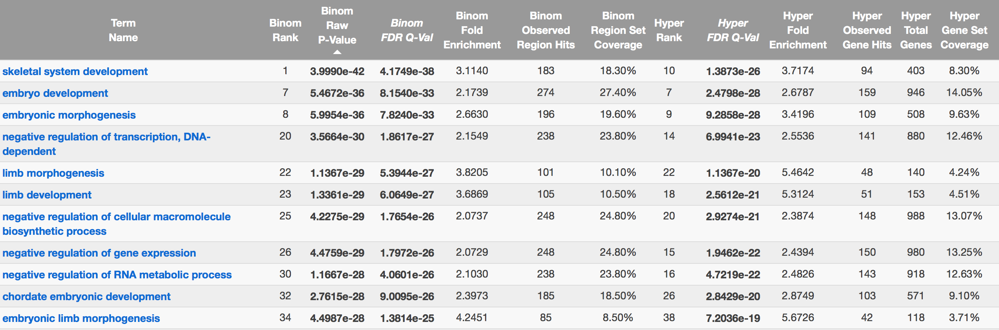</center>
<center><p style="padding-bottom: 7px"><b>Figure 14: </b>Submitting Results to GREAT</p></center>

By comparison: sampling 1000 regions from the original BED file randomly did not result in a significant enrichment for any of these terms. 


